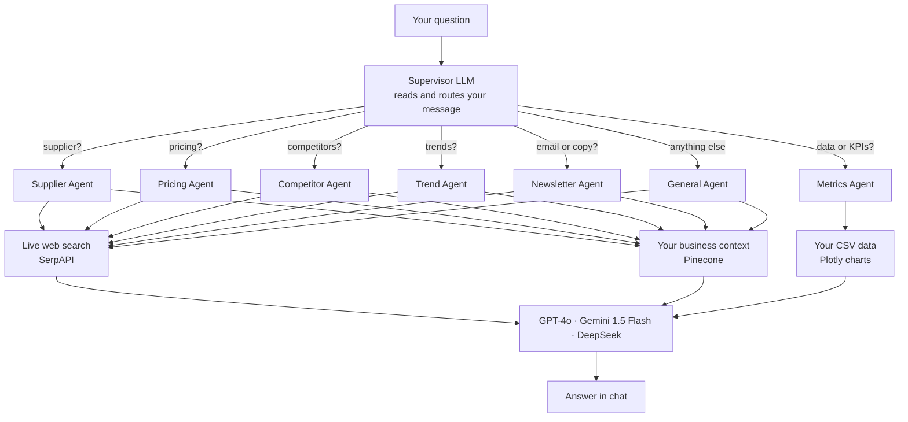

# Business-Pal

Running a business means a lot of tabs. One for finding suppliers, one for watching what competitors are charging, another because you half-remember reading something about a market trend last week. It adds up.

This project puts all of that into one chat. You describe your business once, then just ask things. "Who makes organic cotton fabric in Europe?" "Should I lower my SaaS price?" "Write a re-engagement email for users who churned last month." The right agent picks it up, pulls in live web data plus your specific business context, and answers.

[](LICENSE)
[](https://www.python.org/)
[](https://streamlit.io)

---

## How it works

Every message you send goes through a supervisor LLM that reads it and decides which of seven agents should handle it. That agent then grabs two things: your business context (stored as embeddings in Pinecone) and a fresh web search. Both feed into the LLM, which writes the response.



You never pick an agent yourself. The supervisor reads your message and decides. Both LangGraph graphs — supervisor and metrics — compile once when the server starts and stay cached. They don't rebuild on every message.

---

## The seven agents

| Agent | Try asking it |
| ----- | ------------- |
| Supplier | "Find organic cotton fabric suppliers in Europe" |
| Pricing | "What should I charge for a premium SaaS tier?" |
| Competitor | "Who are my main competitors in specialty coffee?" |
| Trend | "What are the biggest trends in sustainable fashion?" |
| Newsletter | "Write a launch email for our new eco product line" |
| Metrics | "Analyze our revenue growth over the last quarter" |
| General | "How should I approach a Series A pitch?" |

---

## Running it locally

You need Python 3.11 and a few API keys. Five minutes, maybe less.

```bash
git clone https://github.com/saisreepothu/Business-Pal.git
cd Business-Pal

cp .env.example .env
# fill in your keys

pip install -r requirements.txt
streamlit run app.py
```

Open [http://localhost:8501](http://localhost:8501), paste a description of your business in the sidebar, click Set Context, and start asking.

### Prefer Docker?

```bash
cp .env.example .env
docker compose up --build
```

File changes reload automatically inside the container, so you can keep editing without restarting.

---

## Deploying to Coolify

Coolify finds the Dockerfile on its own. Steps:

1. Push to GitHub. Keep `.env` out of git — it's in `.gitignore` already.
2. In Coolify: New Resource → Application → GitHub → pick the repo.
3. Build Pack: Dockerfile.
4. Add your environment variables in Coolify's panel (see the table below).
5. Set port to `8501`.
6. Deploy. Coolify handles HTTPS through Traefik.

---

## Environment variables

| Variable | What it's for |
| -------- | ------------- |
| `OPENAI_API_KEY` | Required unless you switch to Gemini or DeepSeek. Default is GPT-4o. |
| `GOOGLE_API_KEY` | Only needed for Gemini 1.5 Flash |
| `DEEPSEEK_API_KEY` | Only needed for DeepSeek reasoner |
| `SERPAPI_API_KEY` | Web search — all agents use this |
| `PINECONE_API_KEY` | Where your business context gets stored |
| `PINECONE_ENV` | Pinecone region. Defaults to `us-east-1` |

Copy `.env.example` to `.env` and fill in what you have before running.

---

## Metrics CSV format

The Metrics agent needs a CSV with a `Date` column and at least two numeric columns:

```csv
Date,Revenue,Active Users,Churn Rate
2024-01-01,45000,1250,1.2
2024-02-01,52000,1380,1.1
2024-03-01,61000,1470,1.0
```

The sidebar has sample templates for E-Commerce, SaaS, Restaurant, and Retail if you want to check the format before uploading your own data.

---

## Code layout

Streamlit for the UI. LangChain and LangGraph for orchestration. Pinecone for vector storage. SerpAPI for web search. Plotly for charts. Multi-stage Docker build so the production image doesn't carry build tools into it.

```text
Business-Pal/
├── app.py                  # entry point, ~45 lines
├── config/settings.py      # all env vars in one place
├── core/
│   ├── llm_factory.py      # cached LLM clients
│   ├── vector_store.py     # Pinecone, idempotent (no index deletion bug)
│   ├── web_search.py       # SerpAPI with retry and 1hr cache
│   └── workflows.py        # LangGraph graphs, compiled once at startup
├── agents/
│   ├── base.py             # shared base class
│   ├── supplier.py … general.py
│   └── dispatcher.py       # routes supervisor output to the right agent
├── ui/
│   ├── styles.py           # CSS design system
│   ├── sidebar.py          # model picker, context upload, metrics upload
│   ├── chat.py             # chat interface and message history
│   ├── supplier_form.py    # supplier requirements form
│   └── metrics.py          # charts and KPI cards
└── utils/
    ├── session.py          # session state
    └── file_parser.py      # PDF and TXT extraction
```

---

## Contributing

Fork the repo, branch off `main`, open a PR. If you want to add a new agent, `agents/trend.py` is the simplest one to copy from.

---

## License

MIT © 2025 Saisree
